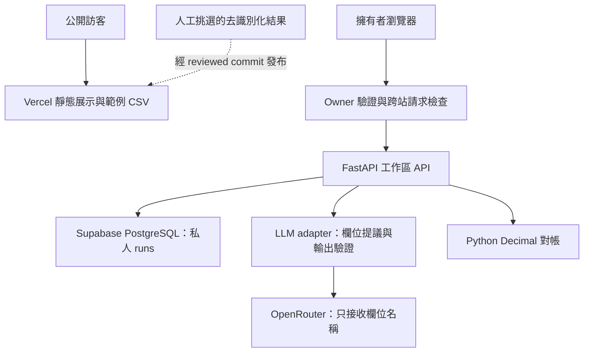
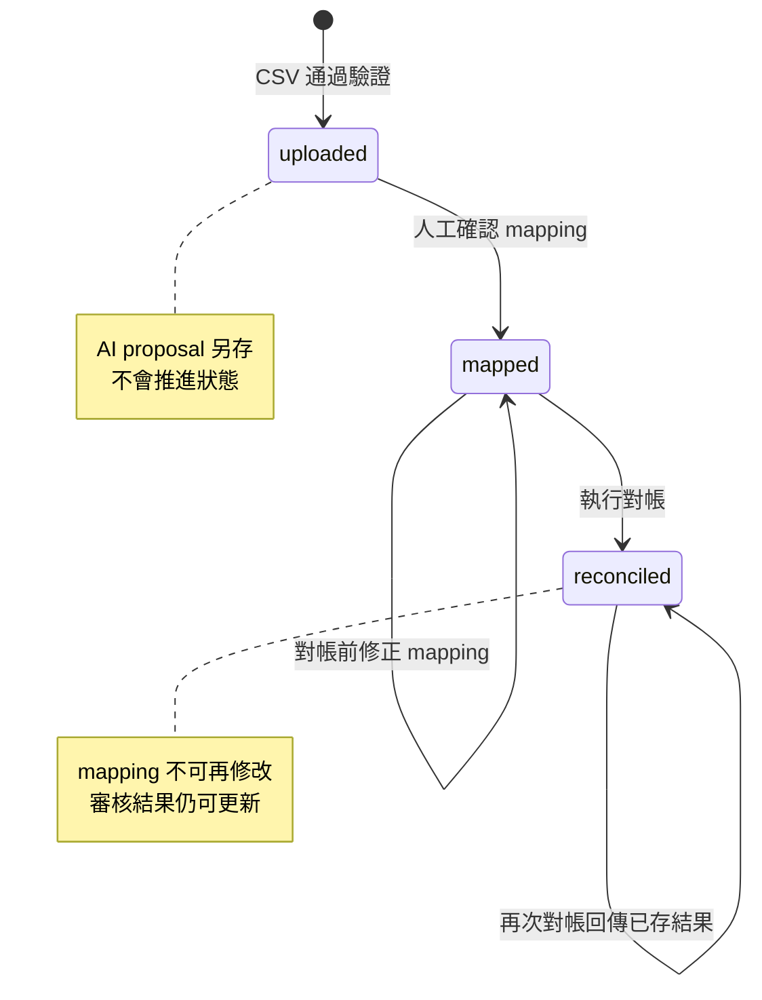

# Ops Reconciliation Copilot

**把不同格式的交易 CSV 轉成可追溯的對帳結果：AI 提議欄位對應，人工確認，程式負責金額計算。**

[公開展示網站](https://ops-reconciliation-copilot.vercel.app/) · [擁有者工作區](https://ops-reconciliation-copilot.vercel.app/workspace) · [工程驗證 CI](https://github.com/ed3c/ops-reconciliation-copilot/actions/runs/34957982988) · [真實模型評估報告](docs/evidence/2026-09-15-luna-medium.json)

Python 3.12 · FastAPI · OpenRouter · PostgreSQL / Supabase · Vercel · Playwright · GitHub Actions

## 先看成果，再看實作

公開網站提供**固定的合成資料範例**，可查看來源列與下載結果，不呼叫 AI、不開放上傳、不公開私人資料。實際操作位於需要登入的工作區。新的展示結果必須先挑選、去識別化，再透過程式碼更新發布；目前沒有一鍵發布功能。

範例 T100：左側來源第 2 列為 100.00 USD，右側來源第 2 列為 98.00 USD，產生 F001 金額差異 **2.00 USD**，再由人員儲存審核決定。可直接比較 [左側 CSV](tests/fixtures/left.csv)、[右側 CSV](tests/fixtures/right.csv) 與 [獨立預期結果](tests/fixtures/expected-export.csv)。

給面試官的三分鐘閱讀路徑：

1. 打開展示站，理解「來源 → 差異 → 人工審核 → 匯出」的業務結果。
2. 看下方設計取捨與資料流，確認模型被授予哪些權限。
3. 查看 [LLM adapter](app/llm.py)、[交易邊界](app/storage.py) 與 [評估報告](docs/evidence/2026-09-15-luna-medium.json)，核對主張與實作。

## 解決的問題與完成範圍

營運人員拿到兩份欄位名稱不同的交易匯出檔，需要先對應交易 ID、金額及幣別，再找出差異並回查來源。錯誤的欄位對應會讓後續算術即使正確，也產生錯誤的業務結論。

本專案把「理解欄位名稱」與「執行對帳規則」分開，讓 AI 提供可拒絕、可修正的建議。它不執行付款、退款或自動帳務調整。

| 功能 | 狀態與證據邊界 |
|---|---|
| CSV 上傳、手動欄位確認、精確 ID 對帳 | 已實作；HTTP 與瀏覽器 CI 驗證 |
| 金額差異、缺少交易、重複 ID、幣別不一致 | 已實作；重複 ID 不猜測配對，異幣不相減 |
| 來源列、審核決定、重新開啟結果、CSV 匯出 | 已實作；獨立 fixture 比對、重啟與瀏覽器驗證 |
| AI 欄位提議、歧義澄清、失敗後手動操作 | 已實作；fake-provider 整合測試及獨立真實模型 smoke evaluation |
| Supabase 持久化、Vercel 公開展示、owner API 保護 | 已部署；公開頁與匿名 API 封鎖已實測 |
| 正式站 owner 登入 → 真實模型 → 審核匯出 | **尚未完成整條路徑的驗證**；部署後還需確認密碼設定與實際操作 |
| 多租戶、不可變審核歷程、企業品質／效能基準 | 未實作或未驗證，不列為既有成果 |

驗證快照日期：2026-09-15。功能程式完成不等同正式環境的所有設定與驗證都已完成。

## 這個作品展示哪些 AI Engineer 能力？

| 能力 | 具體工程決策 | 可檢查的實作／證據 |
|---|---|---|
| 業務問題拆解 | AI 處理欄位語意，規則引擎負責 ID 比對與算術 | [API 與 reconcile](app/main.py) |
| LLM 整合與輸出契約 | 只接受 proposed / clarify；檢查欄位存在、欄位不重複及輸出完整性 | [adapter](app/llm.py)、[契約測試](tests/test_llm.py) |
| Human-in-the-loop | proposal 與 confirmed mapping 分開保存；提議不能直接觸發對帳 | [工作區](app/static/app.js)、[fake-provider browser test](scripts/verify_mapping.py) |
| 評估設計與可重現性 | 人工標註案例；保留 checkout、prompt、dataset hash 與逐筆輸出 | [eval runner](evals/run.py)、[標註資料](evals/cases.jsonl) |
| 可靠性與資料一致性 | 交易內讀改寫、同一 run 列鎖、重複對帳回傳已存結果 | [storage](app/storage.py)、[併發與 rollback 驗證](scripts/verify_postgres.py) |
| 付費 API 與資料保護 | server-side owner 驗證；公開展示不走模型或私人資料 API | [access middleware](app/access.py)、[真實 HTTP 存取測試](scripts/verify_owner.py) |
| 部署與故障診斷 | Vercel 使用外部 PostgreSQL；分開檢查 liveness、DB readiness 與模型設定 | [部署說明](docs/vercel.md)、[資料庫診斷](scripts/init_db.py) |

## 架構與信任邊界



公開頁是固定快照，沒有連到私人 runs 的讀取路徑。API key 與資料庫連線字串只保存在伺服器環境。OpenRouter 收到的是兩側欄位名稱；交易列與金額保存在應用程式資料庫。欄位名稱本身仍可能含敏感資訊，因此實際資料需由擁有者確認適合傳送。

### 一次對帳的資料流

| 步驟 | 資料／請求 | 儲存與控制 |
|---|---|---|
| 1. 上傳 | POST /runs，兩個 CSV 檔 | 驗證 UTF-8、欄位與列結構；每檔最多 1 MB、10,000 列；保存 sources，狀態 uploaded |
| 2. 可選 AI 提議 | POST /runs/{id}/mapping-proposal | 只傳 headers；驗證後保存 mapping_proposal 與 metadata；不更改 confirmed mapping |
| 3. 人工確認 | PUT /runs/{id}/mapping | 驗證兩側各有三個不同且存在的欄位；檢查金額與幣別；狀態 mapped |
| 4. 對帳 | POST /runs/{id}/reconcile | 精確 ID 比對與 Decimal 算術；保存 findings，狀態 reconciled；來源列號隨結果保留 |
| 5. 審核 | PUT /runs/{id}/reviews/{finding_id} | 保存當前 decision / reason；更新會覆寫該 finding 的舊審核值 |
| 6. 匯出 | GET /runs/{id}/export | 從已存 findings 與 reviews 生成 CSV；使用者控制的 ID 做試算表公式防護 |



一次 run 以 JSON 文字保存在 runs(id TEXT PRIMARY KEY, data TEXT NOT NULL)。主要欄位為 sources、mapping、mapping_proposal、findings、reviews。這讓小型工作流程容易保存與還原；代價是更新會重寫整份 run，也不適合大量跨 run 分析或不可變審核歷程。

## 設計取捨：為什麼這樣做？

- **限制模型權限。** 模型不產生金額結論、不直接修改帳務。使用者需確認 mapping，才能交給規則引擎計算。JSON 驗證能擋住結構錯誤，不能保證語意正確，因此保留人工確認。
- **歧義應該澄清。** a / b / c 這類不透明欄名可能無法僅憑 headers 判定。回傳 clarify，避免把猜測包裝成可信對應；不額外傳交易列換取判斷能力。
- **不先加 RAG、微調或多代理。** 當前輸入是兩組短欄名，沒有文件檢索需求；先量測欄位建議與人工修正行為，再決定是否值得增加模型或管線複雜度。
- **限制請求與保留可觀測資料。** 4096-token completion budget、45 秒 socket timeout、64 KiB response limit，無應用層自動重試；記錄 model、prompt hash、token usage、elapsed_ms。Socket timeout 不是整個流程的總時限，單次 budget 也不是帳戶總費用上限。
- **模型失敗不阻斷業務。** 不完整或不合法輸出不寫入 confirmed mapping；前端顯示安全錯誤訊息，仍可手動選欄。原始 provider error body 不回傳給瀏覽器。
- **外部呼叫不占資料庫鎖。** 先讀 headers、結束交易，再呼叫模型；寫回前重新讀取並檢查狀態，避免覆蓋已完成的 run。
- **依執行環境選儲存。** 本機 SQLite 用 BEGIN IMMEDIATE；雲端 PostgreSQL 用 SELECT FOR UPDATE 保護同一 run 的讀改寫。Vercel 未設 DATABASE_URL 時拒絕退回暫存 SQLite。
- **按展示需求設計權限。** 單一 owner 使用 HTTPS Basic authentication，正式環境管理密碼缺漏或太短時 fail closed；私人 response 不可快取，寫入需要自訂 header 並拒絕跨站來源。這是單人存取邊界，沒有多租戶 RBAC、MFA 或完整登入稽核。

## 目錄結構與閱讀順序

| 目錄／檔案 | 責任 |
|---|---|
| [app/main.py](app/main.py) | HTTP endpoints、輸入驗證、run 狀態與純 reconcile 函式 |
| [app/access.py](app/access.py) | owner 驗證、公開路徑清單、CSRF 檢查、private cache headers |
| [app/llm.py](app/llm.py) + [app/prompts/](app/prompts/mapping.txt) | OpenRouter transport、prompt、輸出契約與 metadata |
| [app/storage.py](app/storage.py) | SQLite / PostgreSQL adapter 與交易邊界 |
| [app/workspace.html](app/workspace.html) + [app/static/app.js](app/static/app.js) | 登入後的上傳、mapping、審核與匯出介面 |
| [app/static/](app/static/) | 公開 index.html、showcase.csv 與共用 styles.css；app.js 只由工作區載入 |
| [evals/](evals/) | 人工標註 cases.jsonl 與真實 provider 評估 runner |
| [tests/](tests/) | LLM／設定契約測試；fixtures/ 保存手寫預期 JSON 與 CSV |
| [scripts/verify_runtime.py](scripts/verify_runtime.py) | 真實 HTTP、重啟、獨立 export oracle 與負控制 |
| [scripts/verify_browser.py](scripts/verify_browser.py) + [verify_mapping.py](scripts/verify_mapping.py) | Playwright 登入後流程、行動版檢查、fake-provider 失敗與恢復 |
| [scripts/verify_owner.py](scripts/verify_owner.py)、[verify_db_access.py](scripts/verify_db_access.py)、[verify_postgres.py](scripts/verify_postgres.py) | API 存取、資料庫角色、rollback 與跨程序併發 |
| [.github/workflows/](.github/workflows/) | PR runtime CI、main live evaluation、手動雲端 DB 初始化 |
| [docs/](docs/) | 部署、owner 設定、操作 demo 與已提交的歷史評估證據 |
| [vercel.json](vercel.json)、[.python-version](.python-version)、[requirements.txt](requirements.txt) | FastAPI 部署設定、Python 與依賴版本 |

## 驗證證據：分開看模型品質與系統正確性

| 證據 | 已觀測結果 | 不能據此宣稱 |
|---|---|---|
| [Runtime CI](https://github.com/ed3c/ops-reconciliation-copilot/actions/runs/34957982988) | SQLite、PostgreSQL 兩個 job 通過；14 個 unit tests、10 個 HTTP runtime checks、owner 存取、瀏覽器與 fake-provider 流程 | fake provider 不是模型品質測試 |
| [真實 OpenRouter 評估](https://github.com/ed3c/ops-reconciliation-copilot/actions/runs/34948675162/attempts/2) | canonical、aliases 提議正確；opaque、missing_currency 要求澄清，4/4 通過 | 四筆是 smoke coverage，不能宣稱企業準確率 100% |
| [持久化 JSON 報告](docs/evidence/2026-09-15-luna-medium.json) | 保留逐筆輸出、token、延遲、prompt / dataset hash、checkout SHA | 歷史結果不代表所有後續版本均已重新評估 |
| [PostgreSQL verifier](scripts/verify_postgres.py) | rollback 注入與兩個程序共 20 次更新不遺失 | 未證明 power-loss 或 crash-at-commit durability |
| [部署追蹤 #12](https://github.com/ed3c/ops-reconciliation-copilot/issues/12) | HTTPS 合成資料上傳、對帳、審核讀回與 CSV 比對；加入 owner 保護後匿名私人 API 被封鎖 | 分段驗證不等於正式站登入搭配 live LLM 的端到端驗證 |

歷史模型評估使用 openai/gpt-5.6-luna，reasoning effort medium；評估 checkout 為 78ea5882fa996cf9ef4c900bcc53cd79911b7a7a。四次呼叫合計 **1,038 tokens**（830 prompt、208 completion），單次 client-observed latency **1,184–2,131 ms**。報告未記錄貨幣成本，這四次量測也不足以計算有代表性的 p95。

CI 的預期結果來自手寫 fixtures，不呼叫 reconcile 來產生答案；驗證器還必須拒絕刻意損壞的 export，避免測試與程式一起犯相同錯誤。瀏覽器 screenshot、trace 與 runtime reports 存於 Actions artifacts，保留 14 天；真實模型報告已另行提交，避免只依賴短期 artifact。

## 如何在面試中展示

1. **業務結果：** 展示 T100 的 2.00 USD 差異，回查兩個來源列與審核決定。
2. **AI 的價值與邊界：** 說明 aliases 如何減少人工 mapping；展示 opaque case 的 clarify 輸出；指出「合法 JSON」與「語意正確」是不同問題。
3. **故障情境：** 從 CI 看 provider 首次失敗、第二次恢復，人工 mapping 始終可用；說明為何不自動重試付費請求。
4. **工程可靠性：** 說明獨立 oracle、row lock、交易外模型呼叫，以及 Vercel 為何需要外部持久化。
5. **誠實回答限制：** 尚無代表性企業資料集、人工節省時間量測、多租戶或不可變稽核；提出下一個要量測的問題。

作品重點是能把模型接進一個可驗證、可回退、有清楚權限的業務流程。此專案不展示 GPU 訓練、KV cache 或分散式模型推理能力。

## 下一步：先補證據，再擴功能

- 完成正式站 owner 登入與真實模型的完整瀏覽器驗證，保存去識別化結果。
- 擴充有代表性的欄名測試集：多語、近義欄位、多個金額欄、誤導性／惡意欄名；分開標註 mapping 正確率與應澄清的案例。
- 比較規則式 alias baseline、不同模型與人工操作：量測人工修正率、任務完成時間、延遲分布與每次成功任務成本。目前尚無這些 benchmark。
- 若走向多人企業用途，再加入身分／租戶隔離、append-only 審核事件、資料保留政策與持久化用量配額。

## Run

開發機只需 Python 3.12，**M1 Pro 16 GB 不需 GPU 或本機模型權重**；可先完全使用手動 mapping，選用的模型推理由 OpenRouter 執行。

```sh
python -m venv .venv
. .venv/bin/activate
python -m pip install -r requirements.txt
python -m uvicorn app.main:app
```

本機首頁是公開展示；操作請開啟 [本機工作區](http://127.0.0.1:8000/workspace)。未設定模型 key 或 owner 密碼的本機開發可直接操作，SQLite 預設在 var/reconciliation.sqlite3。設定模型 key 後也必須設定 owner 密碼。環境檔不會自動載入。

| 環境變數 | 用途 |
|---|---|
| RECON_OWNER_PASSWORD | 32 字元以上的獨立隨機管理密碼；正式環境必要；帳號 owner |
| DATABASE_URL | 雲端 PostgreSQL 連線；部署前初始化 schema |
| OPENROUTER_API_KEY | 可選的 server-side 模型 key，不放在瀏覽器或 Git |
| OPENROUTER_MODEL | 模型 ID；歷史評估設定為 openai/gpt-5.6-luna |
| RECON_DB | 可選的本機 SQLite 路徑 |

[部署到 Vercel](docs/vercel.md) · [Supabase 初始化](docs/supabase.md) · [Owner 設定與發布邊界](docs/owner-access.md) · [五分鐘操作流程](docs/demo.md)

GitHub Actions secrets 不會同步到 Vercel。正式環境需另外設定變數並重新部署。Live evaluation 使用 Actions secret OPENROUTER_API_KEY 與 variable OPENROUTER_MODEL；只在 main 的相關檔案變動或手動觸發時執行，會產生模型費用。

## 重現驗證

在未設定真實模型 key 的測試環境執行：

```sh
python -m unittest discover -s tests -p 'test_*.py' -v
python scripts/verify_runtime.py
python scripts/verify_owner.py
python -m pip install -r requirements-browser.txt
python -m playwright install chromium
python scripts/verify_browser.py
python scripts/verify_mapping.py
```

PostgreSQL 測試需專用測試資料庫，設定與步驟見 [runtime workflow](.github/workflows/runtime.yml)。真實模型評估是獨立的 [live-eval workflow](.github/workflows/live-eval.yml)，不把 mock 輸出計入真實模型成績。請勿把私人交易或 credentials 放入公開 CI artifacts。
