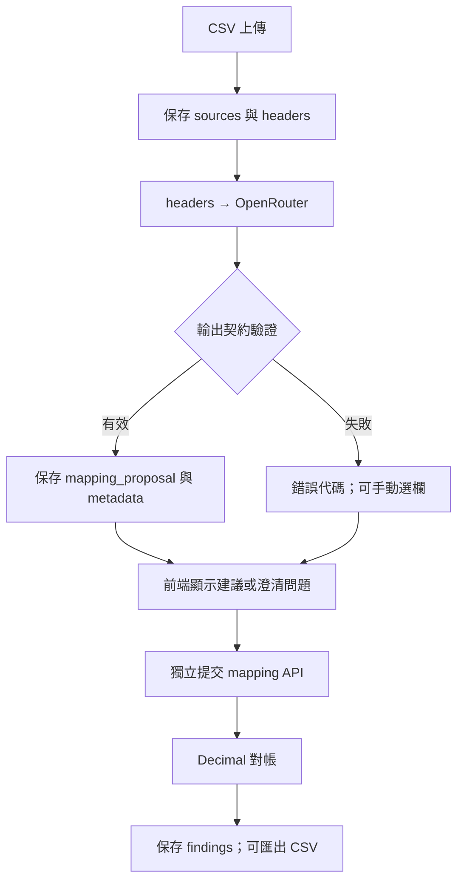

# Ops Reconciliation Copilot

以 LLM 對應兩份 CSV 的欄位名稱，再由 Python 執行確定性的交易比對與金額計算。

[公開展示網站](https://ops-reconciliation-copilot.vercel.app/) · [工作區](https://ops-reconciliation-copilot.vercel.app/workspace) · [Runtime CI](https://github.com/ed3c/ops-reconciliation-copilot/actions/runs/34960696258) · [真實模型評估](docs/evidence/2026-09-15-luna-medium.json)

Python · FastAPI · OpenRouter · PostgreSQL / Supabase · Vercel · GitHub Actions

公開首頁是固定的合成資料範例，不會呼叫模型。真實模型證據來自獨立執行的評估報告；目前尚未完成正式站 Google 登入搭配真實模型的完整瀏覽器驗證。

## 已實作的 AI 功能

| 項目 | 實作與來源 |
|---|---|
| LLM API 串接 | [app/llm.py](app/llm.py) 呼叫 OpenRouter Chat Completions；model 由伺服器環境設定 |
| 輸入範圍 | 只傳送左右 CSV 的 headers，不傳交易列；每側最多 100 個欄名、每個最多 200 字元 |
| 結構化輸出驗證 | 解析 JSON，檢查 status、mapping、question；mapping 必須使用存在且不重複的欄位 |
| 歧義回應 | 接受 proposed 或 clarify；clarify 必須帶問題且 mapping 為 null |
| 模型與計算分離 | mapping_proposal 另存，不能直接改寫 mapping 或執行對帳；金額差異由 Decimal 計算 |
| 失敗處理 | 拒絕截斷、無效 JSON、未知欄位及重複欄位；記錄錯誤代碼，保留手動選欄功能 |
| 執行紀錄 | 保存 requested / response model、prompt hash、token usage、elapsed_ms 與 live_provider |
| 可重現評估 | [evals/run.py](evals/run.py) 執行固定案例並保存逐筆輸出、預期比對結果與版本 hash |

## 實作資料流



這張圖描述已實作的請求與資料處理路徑。proposal 與 mapping 是不同欄位；只有提交並通過 mapping 驗證後，才能呼叫 reconcile。自動化測試會操作這些 API 與前端控制項。

模型呼叫位於資料庫交易之外；回應寫入前重新讀取 run 狀態，若已完成對帳便拒絕寫入。PostgreSQL 的更新使用列鎖，避免同一 run 的讀改寫互相覆蓋。來源見 [app/main.py](app/main.py) 與 [app/storage.py](app/storage.py)。

## 模型呼叫的設計取捨

- **欄名輸入：** 減少送往模型的資料量；代價是無法利用儲存格內容判斷不透明欄名。欄名本身仍可能包含敏感資訊。
- **執行權限：** 模型只產生欄位提議。JSON 與欄位驗證能檢查結構，不能保證欄位語意正確；應用程式保留獨立的 mapping 提交步驟。
- **請求限制：** completion budget 為 4096 tokens、socket timeout 為 45 秒、response limit 為 64 KiB；無應用層自動重試。這些限制不構成帳戶總費用上限。
- **可回溯性：** 每次成功提議保存模型、prompt hash、用量與延遲；評估另外保存 dataset hash 與 checkout SHA。這些是執行紀錄，尚未形成成本儀表板或代表性效能基準。
- **付費 API 保護：** 私人 API 在伺服器端檢查 Google owner session；缺少必要設定時封鎖存取。公開展示頁與模型 API 分離，設定見 [owner access](docs/owner-access.md)。

## 真實模型評估結果

[已提交的 JSON 報告](docs/evidence/2026-09-15-luna-medium.json)來自 [2026-09-15 的 OpenRouter evaluation](https://github.com/ed3c/ops-reconciliation-copilot/actions/runs/34948675162/attempts/2)。這是歷史執行結果，本次文件更新未重新呼叫模型。

| 固定案例 | 預期行為 | 報告結果 |
|---|---|---|
| canonical | 對應標準欄名 | 通過 |
| aliases | 對應 txn_ref / reference_id、amount / paid 等欄名 | 通過 |
| opaque | 回傳 clarify | 通過 |
| missing_currency | 回傳 clarify | 通過 |

- Requested / returned model：openai/gpt-5.6-luna；reasoning effort：medium。
- 評估 checkout：78ea5882fa996cf9ef4c900bcc53cd79911b7a7a。
- 四次呼叫合計 **1,038 tokens**：830 prompt、208 completion。
- 單次 client-observed latency：**1,184–2,131 ms**。
- Runner 對 proposed 比對完整 mapping；對 clarify 僅比對 status，不評分問題品質。

**4/4 是四個固定案例的 smoke coverage。** 尚無代表性企業資料集、模型比較、任務時間改善或貨幣成本量測，不能據此推導企業準確率或 p95。

## 自動化驗證

| 驗證層 | 檢查內容 | 來源 |
|---|---|---|
| 輸出契約 | JSON、欄位存在性／唯一性、澄清格式、截斷回應與 provider error | [tests/test_llm.py](tests/test_llm.py) |
| Provider 整合 | 本機 fake provider 首次失敗、再次成功；提議不直接寫入 mapping | [scripts/verify_mapping.py](scripts/verify_mapping.py) |
| Runtime | 真實 HTTP、對帳結果、保存／讀回、重啟與 CSV 獨立預期值比對；損壞 export 負控制 | [scripts/verify_runtime.py](scripts/verify_runtime.py) |
| 瀏覽器 | 測試登入、上傳、欄位操作及結果匯出 | [scripts/verify_browser.py](scripts/verify_browser.py) |
| CI | SQLite 與 PostgreSQL 兩個 job 通過 | [驗證紀錄](https://github.com/ed3c/ops-reconciliation-copilot/actions/runs/34960696258) |

Fake provider 與測試登入只證明整合行為，不計入真實模型成績。Fixtures 與 CI 中的操作紀錄是測試資料，不代表真實使用者操作或業務採用。

## 與 AI 流程相關的目錄

| 路徑 | 職責 |
|---|---|
| [app/llm.py](app/llm.py) | OpenRouter transport、輸出驗證、錯誤分類與 metadata |
| [app/prompts/mapping.txt](app/prompts/mapping.txt) | 欄位對應 prompt |
| [app/main.py](app/main.py) | proposal / mapping API、run 狀態、確定性 reconcile |
| [app/storage.py](app/storage.py) | 模型提議與對帳結果的持久化、交易邊界 |
| [app/static/app.js](app/static/app.js) | 顯示模型提議、提交 mapping、錯誤後恢復操作 |
| [app/access.py](app/access.py) + [app/google_login.py](app/google_login.py) | 私人資料與付費模型 API 的身分檢查 |
| [evals/cases.jsonl](evals/cases.jsonl) + [evals/run.py](evals/run.py) | 固定輸入／預期值與真實模型評估 |
| [tests/test_llm.py](tests/test_llm.py) + [scripts/verify_mapping.py](scripts/verify_mapping.py) | 模型契約及 provider 整合測試 |
| [.github/workflows/runtime.yml](.github/workflows/runtime.yml) + [live-eval.yml](.github/workflows/live-eval.yml) | 分開執行系統測試與真實模型評估 |
| [docs/evidence/](docs/evidence/) | 保存歷史評估報告 |

## Run

需要 Python 3.12；模型經 API 執行，不需本機 GPU 或模型權重。

```sh
python -m venv .venv
. .venv/bin/activate
python -m pip install -r requirements.txt
python -m uvicorn app.main:app
```

[本機工作區](http://127.0.0.1:8000/workspace)可先使用手動 mapping。設定 OPENROUTER_API_KEY 後，也須完成 [Google owner 設定](docs/owner-access.md)；部署步驟見 [Vercel 文件](docs/vercel.md)。

真實評估使用 OPENROUTER_API_KEY 與 OPENROUTER_MODEL；執行 python evals/run.py 會呼叫 provider 並可能產生費用。CI 的 [live-eval workflow](.github/workflows/live-eval.yml)與一般 runtime tests 分開，缺少模型設定時記錄 not_run，不回報模擬通過。
