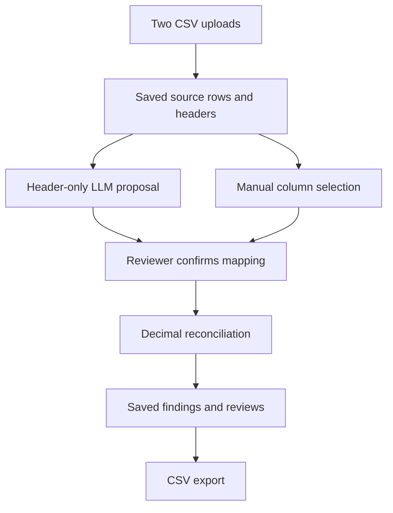

# Reconciliation copilot: reproducible demo

This single-user prototype helps an operations reviewer compare two transaction CSV exports with different column names. The LLM suggests column mappings; the reviewer confirms them; Python computes differences using Decimal. No autonomous financial action is performed.

## Five-minute walkthrough

1. Follow the [local setup](../README.md#run). No GPU is required; Python runs locally and optional model inference runs through OpenRouter. An M1 Pro with 16 GB can use this API-based design without loading model weights.
2. Upload [left.csv](../tests/fixtures/left.csv) and [right.csv](../tests/fixtures/right.csv).
3. If the server has OpenRouter configuration, click **Suggest columns**. Otherwise select the following mappings manually.

| Field | Left | Right |
|---|---|---|
| transaction_id | txn_ref | reference_id |
| amount | amount | paid |
| currency | currency | ccy |

4. Check the selections and submit the mapping form. A proposal alone does not confirm a mapping or reconcile a run.
5. Inspect finding F001: transaction T100, amount_mismatch, left 100.00 USD, right 98.00 USD, delta 2.00.
6. Set F001 to accepted, enter a reason, and save the review. Reload the page to check the saved decision.
7. Keep the page's ?run= URL, stop the server, and restart with the same database path. Reopen that URL and download the CSV. Compare its records with [expected-export.csv](../tests/fixtures/expected-export.csv).

The fixture shows one amount mismatch. Duplicate IDs, currency mismatches and invalid inputs are separate runtime checks; this short walkthrough does not demonstrate every case.

## Data flow and authority



Only header names are sent to OpenRouter. A validated proposal is stored separately from the confirmed mapping. The deterministic reconciler owns transaction matching and arithmetic. Review decisions persist in SQLite. The browser and HTTP tests exercise the service boundary; the model evaluation exercises the provider adapter directly, not a full live-model browser journey.

## Evidence reviewers can inspect

| Evidence | What it supports | Source |
|---|---|---|
| Runtime and browser CI | HTTP upload, reconciliation, review persistence, restart, CSV download, fake-provider integration | [CI run](https://github.com/ed3c/ops-reconciliation-copilot/actions/runs/34948480239) |
| Real OpenRouter evaluation | Four hand-labeled header cases matched expectations | [Attempt 2](https://github.com/ed3c/ops-reconciliation-copilot/actions/runs/34948675162/attempts/2) |
| Preserved JSON report | Outputs, token usage, latency, prompt/dataset hashes and evaluated checkout | [Report](evidence/2026-09-15-luna-medium.json) |

The report is the JSON block parsed from [job 104315328917](https://github.com/ed3c/ops-reconciliation-copilot/actions/runs/34948675162/job/104315328917), with JSON whitespace normalized and no fields changed. It is a historical snapshot, not a newly executed evaluation or a guarantee about subsequent commits.

Evaluated checkout: `78ea5882fa996cf9ef4c900bcc53cd79911b7a7a`.
Requested and returned model: `openai/gpt-5.6-luna`.
Requested reasoning effort: `medium`; completion budget: 4096; socket timeout: 45 seconds.

| Case | Expected behavior | Observed |
|---|---|---|
| canonical | Propose direct column mapping | Pass |
| aliases | Map txn_ref / reference_id and amount / paid | Pass |
| opaque | Ask for clarification | Pass |
| missing_currency | Ask for the missing currency column | Pass |

Provider-reported usage was 830 prompt tokens and 208 completion tokens, totaling 1,038. Client-observed call latency ranged from 1,184 to 2,131 ms. These four measurements do not establish a latency percentile or enterprise accuracy rate.

Attempt 1 exited before model calls because repository configuration was missing. Attempt 2 succeeded after configuration was corrected; no prompt or expected labels were changed to obtain that pass. The original Actions artifact has a 14-day retention window; this committed snapshot preserves the result beyond that window.

## Reproduce the checks

```sh
python -m unittest discover -s tests -p 'test_*.py' -v
python scripts/verify_runtime.py
python -m pip install -r requirements-browser.txt
python -m playwright install chromium
python scripts/verify_browser.py
python scripts/verify_mapping.py
```

For a new live evaluation, configure the repository Actions secret and variable described in the README, then manually run **Live mapping evaluation** on main. It performs four API calls and can incur provider charges. Compare its checkout, prompt and dataset hashes before comparing results.

## Interview discussion

- Why limit AI to proposals? Ambiguous headers can require clarification, and the reviewer must control the mapping used for arithmetic.
- Why Decimal? Currency differences should not inherit binary floating-point rounding errors.
- Why an independent export fixture? A verifier that regenerates its expected result using the implementation can reproduce the same defect.
- What remains unproven? Representative enterprise model quality, a browser journey using the live model, authenticated user isolation, append-only review history, and power-loss/crash-at-commit durability.
